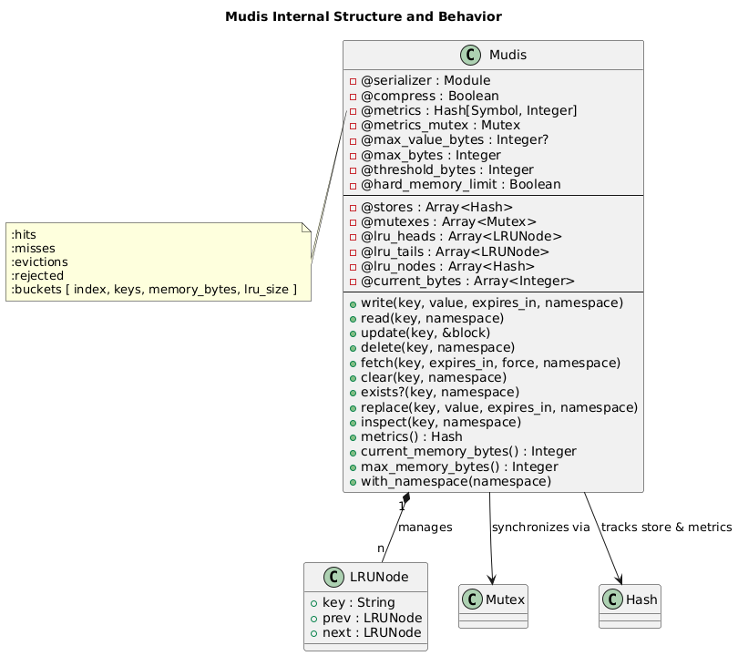
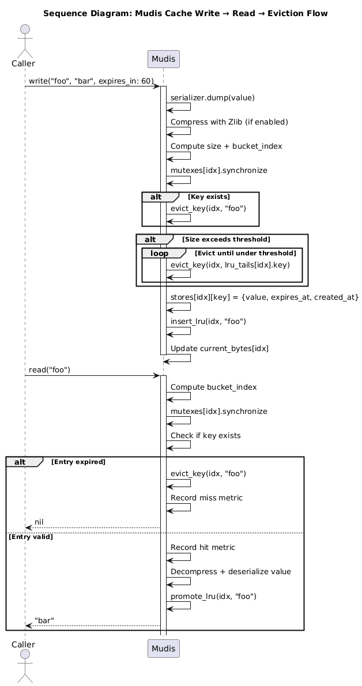
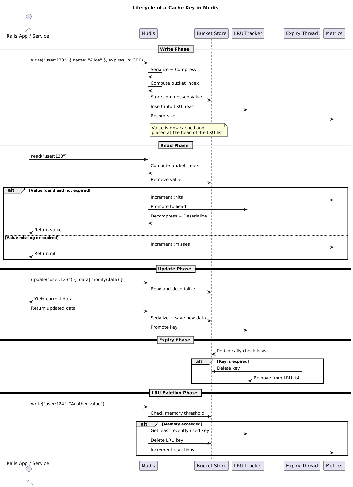

[](https://badge.fury.io/rb/mudis)

**Mudis** is a fast, thread-safe, in-memory, sharded LRU (Least Recently Used) cache for Ruby applications. Inspired by Redis, it provides value serialization, optional compression, per-key expiry, and metric tracking in a lightweight, dependency-free package that lives inside your Ruby process.

It’s ideal for scenarios where performance and process-local caching are critical, and where a full Redis setup is overkill or otherwise not possible/desirable.

Alternatively, Mudis can be upscaled with higher sharding and resources in a dedicated Rails app to provide a [Mudis server](#create-a-mudis-server).

### Why another Caching Gem?

There are plenty out there, in various states of maintenance and in many shapes and sizes. So why on earth do we need another? I needed a drop-in replacement for Kredis, and the reason I was interested in using Kredis was for the simplified API and keyed management it gave me in extension to Redis. But what I didn't really need was Redis. I needed an observable, fast, simple, easy to use, flexible and highly configurable, thread-safe and high performant caching system which didn't require too many dependencies or standing up additional services. So, Mudis was born. In its most rudimentary state it was extremely useful in my project, which was an API gateway connecting into mutliple micro-services and a wide selection of APIs. The majority of the data was cold and produced by repeat expensive queries across several domains. Mudis allowed for me to minimize the footprint of the gateway, and improve end user experience, and increase performance. So, yeah, there's a lot of these gems out there, but none which really met all my needs. I decided to provide Mudis for anyone else. If you use it, I'd be interested to know how and whether you got any benefit.

#### Similar Gems

- [FastCache](https://github.com/swoop-inc/fast_cache)
- [EasyCache](https://github.com/malvads/easycache)
- [MiniCache](https://github.com/derrickreimer/mini_cache)
- [Zache](https://github.com/yegor256/zache)

#### Feature / Function Comparison

| **Feature**                            | **Mudis** | **MemoryStore** (`Rails.cache`) | **FastCache**  | **Zache**     | **EasyCache** | **MiniCache**  |
| -------------------------------------- | ---------------- | ------------------------------- | -------------- | ------------- | ------------- | -------------- |
| **LRU eviction strategy**              | ✅ Per-bucket     | ✅ Global                        | ✅ Global       | ❌             | ❌             | ✅ Simplistic   |
| **TTL expiry support**                 | ✅                | ✅                               | ✅              | ✅             | ✅             | ✅              |
| **Background expiry cleanup thread**   | ✅                | ❌ (only on access)              | ❌              | ✅            | ❌             | ❌              |
| **Thread safety**                      | ✅ Bucketed       | ⚠️ Global lock                  | ✅ Fine-grained | ✅    | ⚠️     | ⚠️      |
| **Sharding (buckets)**                 | ✅                | ❌                               | ✅              | ❌             | ❌             | ❌              |
| **Custom serializers**                 | ✅                | ✅                               | ❌              | ❌             | ❌             | ❌              |
| **Compression (Zlib)**                 | ✅                | ✅                               | ❌              | ❌             | ❌             | ❌              |
| **Hard memory cap**                    | ✅                | ❌                               | ❌              | ❌             | ❌             | ❌              |
| **Max value size enforcement**         | ✅                | ❌                               | ❌              | ❌             | ❌             | ❌              |
| **Metrics (hits, misses, evictions)**  | ✅                | ⚠️ Partial                      | ❌              | ❌             | ❌             | ❌              |
| **Fetch/update pattern**               | ✅ Full           | ✅ Standard                      | ⚠️ Partial     | ✅ Basic       | ✅ Basic       | ✅ Basic        |
| **Namespacing**                        | ✅                | ✅                               | ❌              | ❌             | ❌             | ❌              |
| **Replace (if exists)**                | ✅                | ✅                               | ❌              | ❌             | ❌             | ❌              |
| **Clear/delete method**                | ✅                | ✅                               | ✅              | ✅             | ✅             | ✅              |
| **Key inspection with metadata**       | ✅                | ❌                               | ❌              | ❌             | ❌             | ❌              |
| **Concurrency model**                  | ✅                | ❌                               | ✅              | ❌             | ❌             | ❌              |
| **Maintenance level**                  | ✅                | ✅                               | ✅              | ⚠️            | ⚠️            | ⚠️             |
| **Suitable for APIs or microservices** | ✅                | ⚠️ Limited                      | ✅              | ⚠️ Small apps | ⚠️ Small apps | ❌ |

---

## Design

#### Internal Structure and Behaviour



#### Write - Read - Eviction



#### Cache Key Lifecycle



---

## Features

- **Thread-safe**: Uses per-bucket mutexes for high concurrency.
- **Sharded**: Buckets data across multiple internal stores to minimize lock contention.
- **LRU Eviction**: Automatically evicts least recently used items as memory fills up.
- **Expiry Support**: Optional TTL per key with background cleanup thread.
- **Compression**: Optional Zlib compression for large values.
- **Metrics**: Tracks hits, misses, and evictions.

---

## Installation

Add this line to your Gemfile:

```ruby
gem 'mudis'
```

Or install it manually:

```bash
gem install mudis
```

---

## Configuration (Rails)

In your Rails app, create an initializer:

```ruby
# config/initializers/mudis.rb
Mudis.configure do |c|
  c.serializer = JSON        # or Marshal | Oj
  c.compress = true          # Compress values using Zlib
  c.max_value_bytes = 2_000_000  # Reject values > 2MB
  c.hard_memory_limit = true # enforce hard memory limits
  c.max_bytes = 1_073_741_824 # set maximum cache size
end

Mudis.start_expiry_thread(interval: 60) # Cleanup every 60s

at_exit do
  Mudis.stop_expiry_thread
end
```

Or with direct setters:

```ruby
Mudis.serializer = JSON        # or Marshal | Oj
Mudis.compress = true          # Compress values using Zlib
Mudis.max_value_bytes = 2_000_000  # Reject values > 2MB
Mudis.hard_memory_limit = true # enforce hard memory limits
Mudis.max_bytes = 1_073_741_824 # set maximum cache size

Mudis.start_expiry_thread(interval: 60) # Cleanup every 60s

## set at exit hook
```

---

## Basic Usage

```ruby
require 'mudis'

# Write a value with optional TTL
Mudis.write('user:123', { name: 'Alice' }, expires_in: 600)

# Read it back
Mudis.read('user:123') # => { "name" => "Alice" }

# Check if it exists
Mudis.exists?('user:123') # => true

# Atomically update
Mudis.update('user:123') { |data| data.merge(age: 30) }

# Delete a key
Mudis.delete('user:123')
```

### Developer Utilities

Mudis provides utility methods to help with test environments, console debugging, and dev tool resets.

#### `Mudis.reset!`
Clears the internal cache state. Including all keys, memory tracking, and metrics. Also stops the expiry thread.

```ruby
Mudis.write("foo", "bar")
Mudis.reset!
Mudis.read("foo") # => nil
```

- Wipe all buckets (@stores, @lru_nodes, @current_bytes)
- Reset all metrics (:hits, :misses, :evictions, :rejected)
- Stop any running background expiry thread

#### `Mudis.reset_metrics!`

Clears only the metric counters and preserves all cached values.

```ruby
Mudis.write("key", "value")
Mudis.read("key")    # => "value"
Mudis.metrics        # => { hits: 1, misses: 0, ... }

Mudis.reset_metrics!
Mudis.metrics        # => { hits: 0, misses: 0, ... }
Mudis.read("key")    # => "value" (still cached)
```

---

## Rails Service Integration

For simplified or transient use in a controller, you can wrap your cache logic in a reusable thin class:

```ruby
class MudisService
  attr_reader :cache_key, :namespace

  # Initialize the service with a cache key and optional namespace
  #
  # @param cache_key [String] the base key to use
  # @param namespace [String, nil] optional logical namespace
  def initialize(cache_key, namespace: nil)
    @cache_key = cache_key
    @namespace = namespace
  end

  # Write a value to the cache
  #
  # @param data [Object] the value to cache
  # @param expires_in [Integer, nil] optional TTL in seconds
  def write(data, expires_in: nil)
    Mudis.write(cache_key, data, expires_in: expires_in, namespace: namespace)
  end

  # Read the cached value or return default
  #
  # @param default [Object] fallback value if key is not present
  def read(default: nil)
    Mudis.read(cache_key, namespace: namespace) || default
  end

  # Update the cached value using a block
  #
  # @yieldparam current [Object] the current value
  # @yieldreturn [Object] the updated value
  def update
    Mudis.update(cache_key, namespace: namespace) { |current| yield(current) }
  end

  # Delete the key from cache
  def delete
    Mudis.delete(cache_key, namespace: namespace)
  end

  # Return true if the key exists in cache
  def exists?
    Mudis.exists?(cache_key, namespace: namespace)
  end

  # Fetch from cache or compute and store it
  #
  # @param expires_in [Integer, nil] optional TTL
  # @param force [Boolean] force recomputation
  # @yield return value if key is missing
  def fetch(expires_in: nil, force: false)
    Mudis.fetch(cache_key, expires_in: expires_in, force: force, namespace: namespace) do
      yield
    end
  end

  # Inspect metadata for the current key
  #
  # @return [Hash, nil] metadata including :expires_at, :created_at, :size_bytes, etc.
  def inspect_meta
    Mudis.inspect(cache_key, namespace: namespace)
  end
end

```

Use it like:

```ruby
cache = MudisService.new("user:42:profile", namespace: "users")

cache.write({ name: "Alice" }, expires_in: 300)
cache.read                       # => { "name" => "Alice" }
cache.exists?                    # => true

cache.update { |data| data.merge(age: 30) }
cache.fetch(expires_in: 60) { expensive_query }
cache.inspect_meta               # => { key: "users:user:42:profile", ... }
```

---

## Metrics

Track cache effectiveness and performance:

```ruby
Mudis.metrics
# => {
#   hits: 15,
#   misses: 5,
#   evictions: 3,
#   rejected: 0,
#   total_memory: 45678,
#   buckets: [
#     { index: 0, keys: 12, memory_bytes: 12345, lru_size: 12 },
#     ...
#   ]
# }

```

Optionally, return these metrics from a controller for remote analysis and monitoring if using Rails.

```ruby
class MudisController < ApplicationController
  def metrics
    render json: { mudis: Mudis.metrics }
  end

end
```

---

## Advanced Configuration

| Setting                  | Description                                 | Default            |
|--------------------------|---------------------------------------------|--------------------|
| `Mudis.serializer`       | JSON, Marshal, or Oj                        | `JSON`             |
| `Mudis.compress`         | Enable Zlib compression                     | `false`            |
| `Mudis.max_value_bytes`  | Max allowed size in bytes for a value       | `nil` (no limit)   |
| `Mudis.buckets`          | Number of cache shards        | `32`               |
| `Mudis.start_expiry_thread`    | Background TTL cleanup loop (every N sec)   | Disabled by default|
| `Mudis.hard_memory_limit`    | Enforce hard memory limits on key size and reject if exceeded  | `false`|
| `Mudis.max_bytes`    | Maximum allowed cache size  | `1GB`|

Buckets can also be set using a `MUDIS_BUCKETS` environment variable.

When setting `serializer`, be mindful of the below

| Serializer | Recommended for                       |
| ---------- | ------------------------------------- |
| `Marshal`  | Ruby-only apps, speed-sensitive logic |
| `JSON`     | Cross-language interoperability       |
| `Oj`       | API-heavy apps using JSON at scale    |

#### Benchmarks

Based on 100000 iterations

| Serializer     | Iterations | Total Time (s) | Ops/sec |
|----------------|------------|----------------|---------|
| oj         | 100000     | 0.1342         | 745320  |
| marshal        | 100000     | 0.3228         | 309824  |
| json           | 100000     | 0.9035         | 110682  |
| oj + zlib    | 100000     | 1.8050         | 55401   |
| marshal + zlib   | 100000     | 1.8057         | 55381   |
| json + zlib      | 100000     | 2.7949         | 35780   |

> If opting for OJ, you will need to install the dependency in your project and configure as needed.

---

## Graceful Shutdown

Don’t forget to stop the expiry thread when your app exits:

```ruby
at_exit { Mudis.stop_expiry_thread }
```

---

## Known Limitations

- Data is **non-persistent**.
- Compression introduces CPU overhead.

---

## Create a Mudis Server

### Minimal Setup

- Create a new Rails API app:

```bash
rails new mudis-server --api
cd mudis-server
```

- Add mudis to your Gemfile
- Create Initializer: `config/initializers/mudis.rb`
- Define routes

```ruby
Rails.application.routes.draw do
  get "/cache/:key", to: "cache#show"
  post "/cache/:key", to: "cache#write"
  delete "/cache/:key", to: "cache#delete"
  get "/metrics", to: "cache#metrics"
end
```

- Create a `cache_controller` (with optional per caller/consumer namespace)

```ruby
class CacheController < ApplicationController
  skip_before_action :verify_authenticity_token

  def show
    key = params[:key]
    ns  = params[:namespace]

    value = Mudis.read(key, namespace: ns)
    if value.nil?
      render json: { error: "not found" }, status: :not_found
    else
      render json: { value: value }
    end
  end

  def write
    key = params[:key]
    ns  = params[:namespace]
    val = params[:value]
    ttl = params[:expires_in]&.to_i

    Mudis.write(key, val, expires_in: ttl, namespace: ns)
    render json: { status: "written", key: key }
  end

  def delete
    key = params[:key]
    ns  = params[:namespace]

    Mudis.delete(key, namespace: ns)
    render json: { status: "deleted" }
  end

  def metrics
    render json: Mudis.metrics
  end
end
```

- Test it

```bash
curl http://localhost:3000/cache/foo
curl -X POST http://localhost:3000/cache/foo -d 'value=bar&expires_in=60'
curl http://localhost:3000/metrics

# Write with namespace
curl -X POST "http://localhost:3000/cache/foo?namespace=orders" \
     -d "value=123&expires_in=60"

# Read from namespace
curl "http://localhost:3000/cache/foo?namespace=orders"

# Delete from namespace
curl -X DELETE "http://localhost:3000/cache/foo?namespace=orders"

```

---

## Roadmap

#### API Enhancements

- [ ] bulk_read(keys, namespace:): Batch retrieval of multiple keys with a single method call

#### Safety & Policy Controls

- [ ] max_ttl: Enforce a global upper bound on expires_in to prevent excessively long-lived keys
- [ ] default_ttl: Provide a fallback TTL when one is not specified

#### Debugging

- [ ] clear_namespace(namespace): Remove all keys in a namespace in one call

---

## License

MIT License © kiebor81

---

## Contributing

PRs are welcome! To get started:

```bash
git clone https://github.com/kiebor81/mudis
cd mudis
bundle install

```

---

## Contact

For issues, suggestions, or feedback, please open a GitHub issue

---
