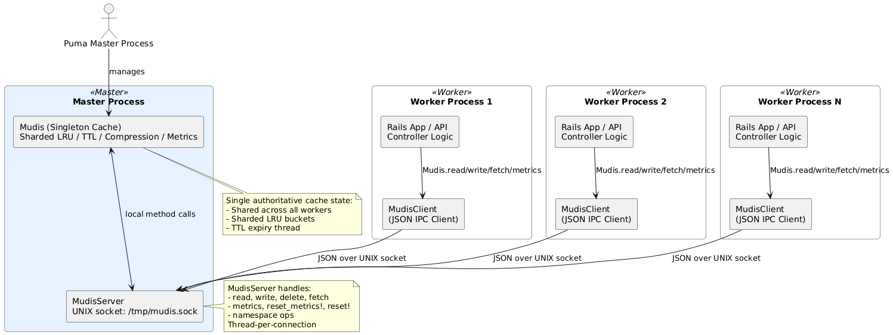

[](https://badge.fury.io/rb/mudis)
[](LICENSE)

**Mudis** is a fast, thread-safe, in-memory, sharded LRU (Least Recently Used) cache for Ruby applications. Inspired by Redis, it provides value serialization, optional compression, per-key expiry, and metric tracking in a lightweight, dependency-free package that lives inside your Ruby process.

It’s ideal for scenarios where performance and process-local caching are critical, and where a full Redis setup is overkill or otherwise not possible/desirable.

Alternatively, Mudis can be upscaled with higher sharding and resources in a dedicated Rails app to provide a [Mudis Web Cache Server](#create-a-mudis-web-cache-server).

Mudis also works naturally in Hanami because it’s a pure Ruby in-memory cache. Whether used as a singleton within a process or via IPC in cluster mode, it preserves Hanami’s lightweight and modular architecture.

---

## Table of Contents

- [Why Another Caching Gem?](#why-another-caching-gem)
  - [Similar Gems](#similar-gems)
  - [Feature / Function Comparison](#feature--function-comparison)
- [Design](#design)
  - [Internal Structure and Behaviour](#internal-structure-and-behaviour)
  - [Write - Read - Eviction](#write---read---eviction)
  - [Cache Key Lifecycle](#cache-key-lifecycle)
- [Features](#features)
- [Installation](#installation)
- [Configuration (Rails)](#configuration-rails)
- [Configuration (Hanami)](#configuration-hanami)
- [Basic Usage](#basic-usage)
  - [Developer Utilities](#developer-utilities)
    - [`Mudis.reset!`](#mudisreset)
    - [`Mudis.reset_metrics!`](#mudisreset_metrics)
    - [`Mudis.least_touched`](#mudisleast_touched)
    - [`Mudis.keys(namespace:)`](#mudiskeysnamespace)
    - [`Mudis.clear_namespace(namespace:)`](#mudisclear_namespacenamespace)
- [Rails Service Integration](#rails-service-integration)
- [Metrics](#metrics)
- [Advanced Configuration](#advanced-configuration)
- [Benchmarks](#benchmarks)
- [Graceful Shutdown](#graceful-shutdown)
- [Known Limitations](#known-limitations)
- [Inter-Process Caching (IPC Mode)](#inter-process-caching-ipc-mode)
  - [Overview](#overview)
  - [Setup (Puma / Rails)](#setup-puma--rails)
- [Create a Mudis Web Cache Server](#create-a-mudis-web-cache-server)
  - [Minimal Setup](#minimal-setup)
- [Project Philosophy](#project-philosophy)
- [Roadmap](#roadmap)

---

### Why another Caching Gem?

There are plenty out there, in various states of maintenance and in many shapes and sizes. So why on earth do we need another? I needed a drop-in replacement for Kredis, and the reason I was interested in using Kredis was for the simplified API and keyed management it gave me in extension to Redis. But what I didn't really need was Redis. I needed an observable, fast, simple, easy to use, flexible and highly configurable, thread-safe and high performant caching system which didn't require too many dependencies or standing up additional services. So, Mudis was born. In its most rudimentary state it was extremely useful in my project, which was an API gateway connecting into mutliple micro-services and a wide selection of APIs. The majority of the data was cold and produced by repeat expensive queries across several domains. Mudis allowed for me to minimize the footprint of the gateway, and improve end user experience, and increase performance. So, yeah, there's a lot of these gems out there, but none which really met all my needs. I decided to provide Mudis for anyone else. If you use it, I'd be interested to know how and whether you got any benefit.

#### Similar Gems

- [FastCache](https://github.com/swoop-inc/fast_cache)
- [EasyCache](https://github.com/malvads/easycache)
- [MiniCache](https://github.com/derrickreimer/mini_cache)
- [Zache](https://github.com/yegor256/zache)

#### Feature / Function Comparison

| **Feature**                            | **Mudis** | **MemoryStore** (`Rails.cache`) | **FastCache**  | **Zache**     | **EasyCache** | **MiniCache**  |
| -------------------------------------- | ---------------- | ------------------------------- | -------------- | ------------- | ------------- | -------------- |
| **LRU eviction strategy**              | ✅ Per-bucket     | ✅ Global                        | ✅ Global       | ❌             | ❌             | ✅ Simplistic   |
| **TTL expiry support**                 | ✅                | ✅                               | ✅              | ✅             | ✅             | ✅              |
| **Background expiry cleanup thread**   | ✅                | ❌ (only on access)              | ❌              | ✅            | ❌             | ❌              |
| **Thread safety**                      | ✅ Bucketed       | ⚠️ Global lock                  | ✅ Fine-grained | ✅    | ⚠️     | ⚠️      |
| **Sharding (buckets)**                 | ✅                | ❌                               | ✅              | ❌             | ❌             | ❌              |
| **Custom serializers**                 | ✅                | ✅                               | ❌              | ❌             | ❌             | ❌              |
| **Compression (Zlib)**                 | ✅                | ✅                               | ❌              | ❌             | ❌             | ❌              |
| **Hard memory cap**                    | ✅                | ❌                               | ❌              | ❌             | ❌             | ❌              |
| **Max value size enforcement**         | ✅                | ❌                               | ❌              | ❌             | ❌             | ❌              |
| **Metrics (hits, misses, evictions)**  | ✅                | ⚠️ Partial                      | ❌              | ❌             | ❌             | ❌              |
| **Fetch/update pattern**               | ✅ Full           | ✅ Standard                      | ⚠️ Partial     | ✅ Basic       | ✅ Basic       | ✅ Basic        |
| **Namespacing**                        | ✅                | ✅                               | ❌              | ❌             | ❌             | ❌              |
| **Replace (if exists)**                | ✅                | ✅                               | ❌              | ❌             | ❌             | ❌              |
| **Clear/delete method**                | ✅                | ✅                               | ✅              | ✅             | ✅             | ✅              |
| **Key inspection with metadata**       | ✅                | ❌                               | ❌              | ❌             | ❌             | ❌              |
| **Concurrency model**                  | ✅                | ❌                               | ✅              | ❌             | ❌             | ❌              |
| **Maintenance level**                  | ✅                | ✅                               | ✅              | ⚠️            | ⚠️            | ⚠️             |
| **Suitable for APIs or microservices** | ✅                | ⚠️ Limited                      | ✅              | ⚠️ Small apps | ⚠️ Small apps | ❌ |
| **Inter-process Caching** | ✅                | ❌                     | ❌              | ❌ | ❌ | ❌ |

---

## Design

#### Internal Structure and Behaviour


#### Write - Read - Eviction


#### Cache Key Lifecycle


---

## Features

- **Thread-safe**: Uses per-bucket mutexes for high concurrency.
- **Sharded**: Buckets data across multiple internal stores to minimize lock contention.
- **LRU Eviction**: Automatically evicts least recently used items as memory fills up.
- **Expiry Support**: Optional TTL per key with background cleanup thread.
- **Compression**: Optional Zlib compression for large values.
- **Metrics**: Tracks hits, misses, and evictions.
- **IPC Mode**: Shared cross-process caching for multi-process aplications.

---

## Installation

Add this line to your Gemfile:

```ruby
gem 'mudis'
```

Or install it manually:

```bash
gem install mudis
```

---

## Configuration (Rails)

In your Rails app, create an initializer:

```ruby
# config/initializers/mudis.rb
Mudis.configure do |c|
  c.serializer = JSON        # or Marshal | Oj
  c.compress = true          # Compress values using Zlib
  c.max_value_bytes = 2_000_000  # Reject values > 2MB
  c.hard_memory_limit = true # enforce hard memory limits
  c.max_bytes = 1_073_741_824 # set maximum cache size
end

Mudis.start_expiry_thread(interval: 60) # Cleanup every 60s

at_exit do
  Mudis.stop_expiry_thread
end
```

Or with direct setters:

```ruby
Mudis.serializer = JSON        # or Marshal | Oj
Mudis.compress = true          # Compress values using Zlib
Mudis.max_value_bytes = 2_000_000  # Reject values > 2MB
Mudis.hard_memory_limit = true # enforce hard memory limits
Mudis.max_bytes = 1_073_741_824 # set maximum cache size

Mudis.start_expiry_thread(interval: 60) # Cleanup every 60s

## set at exit hook
```

---

## Configuration (Hanami)

Mudis integrates seamlessly with [Hanami](https://hanamirb.org) applications. It provides the same configuration flexibility and thread-safe caching capabilities as in Rails, with minimal setup differences.

Create a boot file:

```ruby
# config/boot/mudis.rb
require "mudis"

Mudis.configure do |c|
  c.serializer = JSON
  c.compress = true
  c.max_value_bytes = 2_000_000
  c.hard_memory_limit = true
  c.max_bytes = 1_073_741_824
end

Mudis.start_expiry_thread(interval: 60)

at_exit { Mudis.stop_expiry_thread }
```

Then require it from `config/app.rb`:

```ruby
# config/app.rb
require_relative "./boot/mudis"

module MyApp
  class App < Hanami::App
  end
end
```

This ensures Mudis is initialized and available globally throughout your Hanami application in the same as it would in Rails.

---

### Using Mudis with Hanami’s Dependency Container

You can register Mudis as a dependency in the Hanami container to access it via dependency injection:

```ruby
# config/container.rb
require "mudis"

MyApp::Container.register(:cache, Mudis)
```

Then use it inside your actions, repositories, or services:

```ruby
# apps/main/actions/users/show.rb
module Main
  module Actions
    module Users
      class Show < Main::Action
        include Deps[cache: "cache"]

        def handle(req, res)
          res[:user] = cache.fetch("user:#{req.params[:id]}", expires_in: 60) do
            UserRepo.new.find(req.params[:id])
          end
        end
      end
    end
  end
end
```

---

## Basic Usage

```ruby
require 'mudis'

# Write a value with optional TTL
Mudis.write('user:123', { name: 'Alice' }, expires_in: 600)

# Read it back
Mudis.read('user:123') # => { "name" => "Alice" }

# Check if it exists
Mudis.exists?('user:123') # => true

# Atomically update
Mudis.update('user:123') { |data| data.merge(age: 30) }

# Delete a key
Mudis.delete('user:123')
```

### Developer Utilities

Mudis provides utility methods to help with test environments, console debugging, and dev tool resets.

#### `Mudis.reset!`
Clears the internal cache state. Including all keys, memory tracking, and metrics. Also stops the expiry thread.

```ruby
Mudis.write("foo", "bar")
Mudis.reset!
Mudis.read("foo") # => nil
```

- Wipe all buckets (@stores, @lru_nodes, @current_bytes)
- Reset all metrics (:hits, :misses, :evictions, :rejected)
- Stop any running background expiry thread

#### `Mudis.reset_metrics!`

Clears only the metric counters and preserves all cached values.

```ruby
Mudis.write("key", "value")
Mudis.read("key")    # => "value"
Mudis.metrics        # => { hits: 1, misses: 0, ... }

Mudis.reset_metrics!
Mudis.metrics        # => { hits: 0, misses: 0, ... }
Mudis.read("key")    # => "value" (still cached)
```

#### `Mudis.least_touched`

Returns the top `n` (or all) keys that have been read the fewest number of times, across all buckets. This is useful for identifying low-value cache entries that may be safe to remove or exclude from caching altogether.

Each result includes the full key and its access count.

```ruby
Mudis.least_touched
# => [["foo", 0], ["user:42", 1], ["product:123", 2], ...]

Mudis.least_touched(5)
# => returns top 5 least accessed keys
```

#### `Mudis.keys(namespace:)`

Returns all keys for a given namespace.

```ruby
Mudis.write("u1", "alpha", namespace: "users")
Mudis.write("u2", "beta", namespace: "users")

Mudis.keys(namespace: "users")
# => ["u1", "u2"]

```

#### `Mudis.clear_namespace(namespace:)`

Deletes all keys within a namespace.

```ruby
Mudis.clear_namespace("users")
Mudis.read("u1", namespace: "users") # => nil
```

---

## Rails Service Integration

For simplified or transient use in a controller, you can wrap your cache logic in a reusable thin class:

```ruby
class MudisService
  attr_reader :cache_key, :namespace

  # Initialize the service with a cache key and optional namespace
  #
  # @param cache_key [String] the base key to use
  # @param namespace [String, nil] optional logical namespace
  def initialize(cache_key, namespace: nil)
    @cache_key = cache_key
    @namespace = namespace
  end

  # Write a value to the cache
  #
  # @param data [Object] the value to cache
  # @param expires_in [Integer, nil] optional TTL in seconds
  def write(data, expires_in: nil)
    Mudis.write(cache_key, data, expires_in: expires_in, namespace: namespace)
  end

  # Read the cached value or return default
  #
  # @param default [Object] fallback value if key is not present
  def read(default: nil)
    Mudis.read(cache_key, namespace: namespace) || default
  end

  # Update the cached value using a block
  #
  # @yieldparam current [Object] the current value
  # @yieldreturn [Object] the updated value
  def update
    Mudis.update(cache_key, namespace: namespace) { |current| yield(current) }
  end

  # Delete the key from cache
  def delete
    Mudis.delete(cache_key, namespace: namespace)
  end

  # Return true if the key exists in cache
  def exists?
    Mudis.exists?(cache_key, namespace: namespace)
  end

  # Fetch from cache or compute and store it
  #
  # @param expires_in [Integer, nil] optional TTL
  # @param force [Boolean] force recomputation
  # @yield return value if key is missing
  def fetch(expires_in: nil, force: false)
    Mudis.fetch(cache_key, expires_in: expires_in, force: force, namespace: namespace) do
      yield
    end
  end

  # Inspect metadata for the current key
  #
  # @return [Hash, nil] metadata including :expires_at, :created_at, :size_bytes, etc.
  def inspect_meta
    Mudis.inspect(cache_key, namespace: namespace)
  end
end

```

Use it like:

```ruby
cache = MudisService.new("user:42:profile", namespace: "users")

cache.write({ name: "Alice" }, expires_in: 300)
cache.read                       # => { "name" => "Alice" }
cache.exists?                    # => true

cache.update { |data| data.merge(age: 30) }
cache.fetch(expires_in: 60) { expensive_query }
cache.inspect_meta               # => { key: "users:user:42:profile", ... }
```

---

## Metrics

Track cache effectiveness and performance:

```ruby
Mudis.metrics
# => {
#   hits: 15,
#   misses: 5,
#   evictions: 3,
#   rejected: 0,
#   total_memory: 45678,
#   least_touched: [
#     ["user:1", 0],
#     ["post:5", 1],
#     ...
#   ],
#   buckets: [
#     { index: 0, keys: 12, memory_bytes: 12345, lru_size: 12 },
#     ...
#   ]
# }

```

Optionally, return these metrics from a controller for remote analysis and monitoring if using Rails.

```ruby
class MudisController < ApplicationController
  def metrics
    render json: { mudis: Mudis.metrics }
  end

end
```

---

## Advanced Configuration

| Setting                  | Description                                 | Default            |
|--------------------------|---------------------------------------------|--------------------|
| `Mudis.serializer`       | JSON, Marshal, or Oj                        | `JSON`             |
| `Mudis.compress`         | Enable Zlib compression                     | `false`            |
| `Mudis.max_value_bytes`  | Max allowed size in bytes for a value       | `nil` (no limit)   |
| `Mudis.buckets`          | Number of cache shards        | `32`               |
| `Mudis.start_expiry_thread`    | Background TTL cleanup loop (every N sec)   | Disabled by default|
| `Mudis.hard_memory_limit`    | Enforce hard memory limits on key size and reject if exceeded  | `false`|
| `Mudis.max_bytes`    | Maximum allowed cache size  | `1GB`|
| `Mudis.max_ttl`    | Set the maximum permitted TTL  | `nil` (no limit) |
| `Mudis.default_ttl`    | Set the default TTL for fallback when none is provided  | `nil` |

Buckets can also be set using a `MUDIS_BUCKETS` environment variable.

When setting `serializer`, be mindful of the below

| Serializer | Recommended for                       |
| ---------- | ------------------------------------- |
| `Marshal`  | Ruby-only apps, speed-sensitive logic |
| `JSON`     | Cross-language interoperability       |
| `Oj`       | API-heavy apps using JSON at scale    |

---

## Benchmarks

#### Serializer(s)

_100000 iterations_

| Serializer     | Total Time (s) | Ops/sec |
|----------------|------------|----------------|
| oj         | 0.1342         | 745320  |
| marshal        | 0.3228         | 309824  |
| json           | 0.9035         | 110682  |
| oj + zlib    | 1.8050         | 55401   |
| marshal + zlib   | 1.8057         | 55381   |
| json + zlib      | 2.7949         | 35780   |

> If opting for OJ, you will need to install the dependency in your project and configure as needed.

#### Mudis vs Rails.cache

Mudis is marginally slower than `Rails.cache` by design; it trades raw speed for control, observability, and safety.

_10000 iterations of 1MB, Marshal (to match MemoryStore default), compression ON_

| Operation | `Rails.cache` | `Mudis`     | Delta     |
| --------- | ------------- | ----------- | --------- |
| Write     | 2.139 ms/op   | 2.417 ms/op | +0.278 ms |
| Read      | 0.007 ms/op   | 0.810 ms/op | +0.803 ms |

> For context: a typical database query or HTTP call takes 10–50ms. A difference of less than 1ms per operation is negligible for most apps.

#### **Why this overhead exists**

Mudis includes features that MemoryStore doesn’t:

| Feature            | Mudis                  | Rails.cache (MemoryStore)   |
| ------------------ | ---------------------- | --------------------------- |
| Per-key TTL expiry | ✅    | ⚠️ on access |
| True LRU eviction  | ✅     | ❌          |
| Hard memory limits | ✅                   | ❌         |
| Value compression  | ✅     | ❌             |
| Thread safety      | ✅ Bucket-level mutexes | ✅ Global mutex              |
| Observability      | ✅         | ❌           |
| Namespacing        | ✅           | ❌ Manual scoping        |
| IPC Aware        | ✅ (if enabled) | ❌ Requires manual configuration and additional gems       |

It will be down to the developer to decide if a fraction of a millisecond is worth

- Predictable eviction
- Configurable expiry
- Memory protection
- Namespace scoping
- Real-time metrics for hits, misses, evictions, memory usage

_10000 iterations of 1MB, Marshal (to match MemoryStore default), compression OFF (to match MemoryStore default)_

| Operation | `Rails.cache` | `Mudis`     | Delta         |
| --------- | ------------- | ----------- | ------------- |
| Write     | 2.342 ms/op   | 0.501 ms/op | **−1.841 ms** |
| Read      | 0.007 ms/op   | 0.011 ms/op | +0.004 ms     |

With compression disabled, Mudis writes significanty faster and reads are virtually identical. Optimisation and configuration of Mudis will be determined by your individual needs.

#### Other Benchmarks

_10000 iterations of 512KB, JSON, compression OFF (to match MemoryStore default)_

| Operation | `Rails.cache` | `Mudis`     | Delta         |
| --------- | ------------- | ----------- | ------------- |
| Write     | 1.291 ms/op   | 0.32 ms/op | **−0.971 ms** |
| Read      | 0.011 ms/op   | 0.048 ms/op | +0.037 ms     |

_10000 iterations of 512KB, JSON, compression ON_

| Operation | `Rails.cache` | `Mudis`     | Delta         |
| --------- | ------------- | ----------- | ------------- |
| Write     | 1.11 ms/op   | 1.16 ms/op |  +0.05 ms |
| Read      | 0.07 ms/op   | 0.563 ms/op | +0.493 ms     |

---

## Graceful Shutdown

Don’t forget to stop the expiry thread when your app exits:

```ruby
at_exit { Mudis.stop_expiry_thread }
```

---

## Known Limitations

- Data is **non-persistent**.
- Compression introduces CPU overhead.

---

## Inter-Process Caching (IPC Mode)

While Mudis was originally designed as an in-process cache, it can also operate as a shared inter-process cache when running in environments that use concurrent processes (such as Puma in cluster mode). This is achieved through a local UNIX socket server that allows all workers to access a single, centralized Mudis instance.

### Overview

In IPC mode, Mudis runs as a singleton server within the master process.

Each worker connects to that server through a lightweight client (`MudisClient`) using a local UNIX domain socket (default: `/tmp/mudis.sock`).
All cache operations, e.g., read, write, delete, fetch, etc., are transparently proxied to the master process, which holds the authoritative cache state.

This design allows multiple workers to share the same cache without duplicating memory or losing synchronization, while retaining Mudis’ performance, configurability, and thread safety.

| **Benefit**                       | **Description**                                                                          |
| --------------------------------- | ---------------------------------------------------------------------------------------- |
| **Shared Cache Across Processes** | All Puma workers share one Mudis instance via IPC.                                       |
| **Zero External Dependencies**    | No Redis, Memcached, or separate daemon required.                                        |
| **Memory Efficient**              | Cache data stored only once, not duplicated per worker.                                  |
| **Full Feature Support**          | All Mudis features (TTL, compression, metrics, etc.) work transparently.                 |
| **Safe & Local**                  | Communication is limited to the host system’s UNIX socket, ensuring isolation and speed. |



### Setup (Puma / Rails)

Enable IPC mode by adding the following to your Puma configuration:

```ruby
# config/puma.rb
preload_app!

before_fork do
  require "mudis"
  require "mudis_server"

  # Your typical Mudis configuration (previously in a Rails initializer)
  Mudis.configure do |c|
    c.serializer = JSON
    c.compress = true
    c.max_value_bytes = 2_000_000
    c.hard_memory_limit = true
    c.max_bytes = 1_073_741_824
  end

  Mudis.start_expiry_thread(interval: 60)
  MudisServer.start!

  at_exit { Mudis.stop_expiry_thread }
end

on_worker_boot do
  require "mudis_client"
  $mudis = MudisClient.new
end
```

Adding this Proxy to initializers allows seamless use of the API as documented. 

```ruby
# config/initializers/mudis_proxy.rb
unless defined?(MudisServer)
  class Mudis
    def self.read(*a, **k) = $mudis.read(*a, **k)
    def self.write(*a, **k) = $mudis.write(*a, **k)
    def self.delete(*a, **k) = $mudis.delete(*a, **k)
    def self.fetch(*a, **k, &b) = $mudis.fetch(*a, **k, &b)
    def self.metrics = $mudis.metrics
    def self.reset_metrics! = $mudis.reset_metrics!
    def self.reset! = $mudis.reset!
  end

end
```

**Use IPC mode when:**

- Running Rails or Rack apps under Puma cluster or multi-process background job workers.
- You need cache consistency and memory efficiency without standing up Redis.
- You want to preserve Mudis’s observability, configurability, and in-process simplicity at a larger scale.

---

## Create a Mudis Web Cache Server

### Minimal Setup

- Create a new Rails API app:

```bash
rails new mudis-server --api
cd mudis-server
```

- Add mudis to your Gemfile
- Create Initializer: `config/initializers/mudis.rb`
- Define routes

```ruby
Rails.application.routes.draw do
  get "/cache/:key", to: "cache#show"
  post "/cache/:key", to: "cache#write"
  delete "/cache/:key", to: "cache#delete"
  get "/metrics", to: "cache#metrics"
end
```

- Create a `cache_controller` (with optional per caller/consumer namespace)

```ruby
class CacheController < ApplicationController

  def show
    key = params[:key]
    ns  = params[:namespace]

    value = Mudis.read(key, namespace: ns)
    if value.nil?
      render json: { error: "not found" }, status: :not_found
    else
      render json: { value: value }
    end
  end

  def write
    key = params[:key]
    ns  = params[:namespace]
    val = params[:value]
    ttl = params[:expires_in]&.to_i

    Mudis.write(key, val, expires_in: ttl, namespace: ns)
    render json: { status: "written", key: key }
  end

  def delete
    key = params[:key]
    ns  = params[:namespace]

    Mudis.delete(key, namespace: ns)
    render json: { status: "deleted" }
  end

  def metrics
    render json: Mudis.metrics
  end
end
```

- Test it

```bash
curl http://localhost:3000/cache/foo
curl -X POST http://localhost:3000/cache/foo -d 'value=bar&expires_in=60'
curl http://localhost:3000/metrics

# Write with namespace
curl -X POST "http://localhost:3000/cache/foo?namespace=orders" \
     -d "value=123&expires_in=60"

# Read from namespace
curl "http://localhost:3000/cache/foo?namespace=orders"

# Delete from namespace
curl -X DELETE "http://localhost:3000/cache/foo?namespace=orders"

```

---

## Project Philosophy

Mudis is intended to be a minimal, thread-safe, in-memory cache designed specifically for Ruby applications. It focuses on:

- In-process caching
- Fine-grained memory and namespace control
- Observability and testing friendliness
- Minimal external dependencies
- Configurability without complexity

The primary use cases are:

- Per-service application caches
- Short-lived local caching inside background jobs or API layers

Mudis is not intended to be a general-purpose, distributed caching platform. You are, however, welcome to build on top of Mudis if you want its functionality in such projects. E.g.,

- mudis-web-cache-server – expose Mudis via HTTP, web sockets, hooks, etc
- mudis-broker – distributed key routing layer for coordinating multiple Mudis nodes
- mudis-activejob-store – adapter for using Mudis in job queues or retry buffers

---

## Roadmap

#### API Enhancements

- [x] bulk_read(keys, namespace:): Batch retrieval of multiple keys with a single method call

#### Safety & Policy Controls

- [x] max_ttl: Enforce a global upper bound on expires_in to prevent excessively long-lived keys
- [x] default_ttl: Provide a fallback TTL when one is not specified

#### Debugging

- [x] clear_namespace(namespace): Remove all keys in a namespace in one call

#### Refactor Mudis 

- [x] Review Mudis for improved readability and reduce complexity in top-level functions
- [x] Enhanced guards
- [ ] Review for functionality gaps and enhance as needed 

---

## License

MIT License © kiebor81

---

## Contributing

See [contributor's guide](CONTRIBUTING.md)

---

## Contact

For issues, suggestions, or feedback, please open a GitHub issue

---
